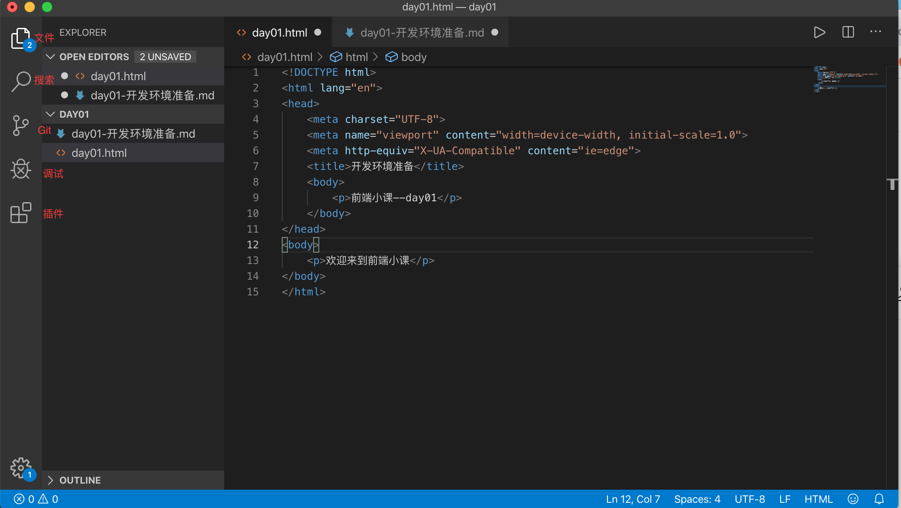
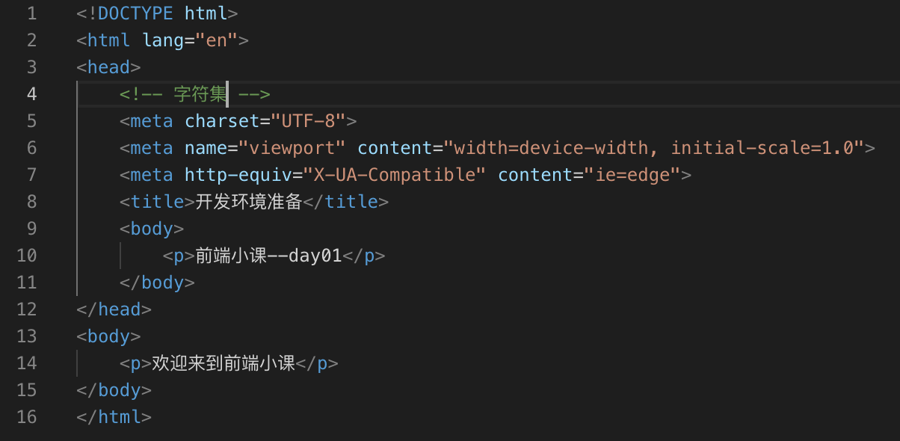
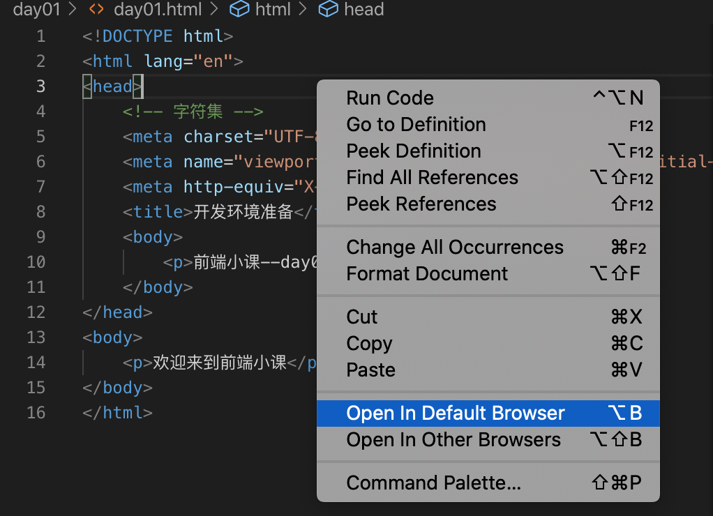
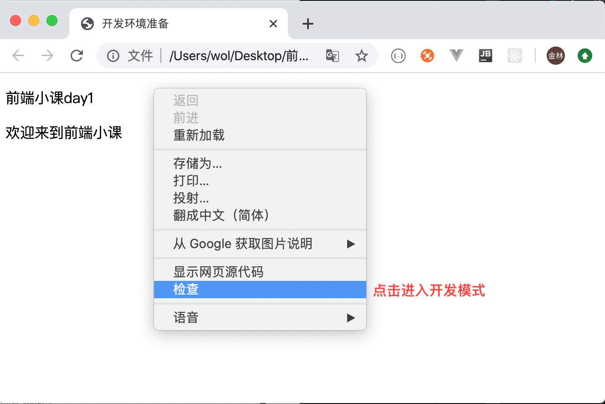
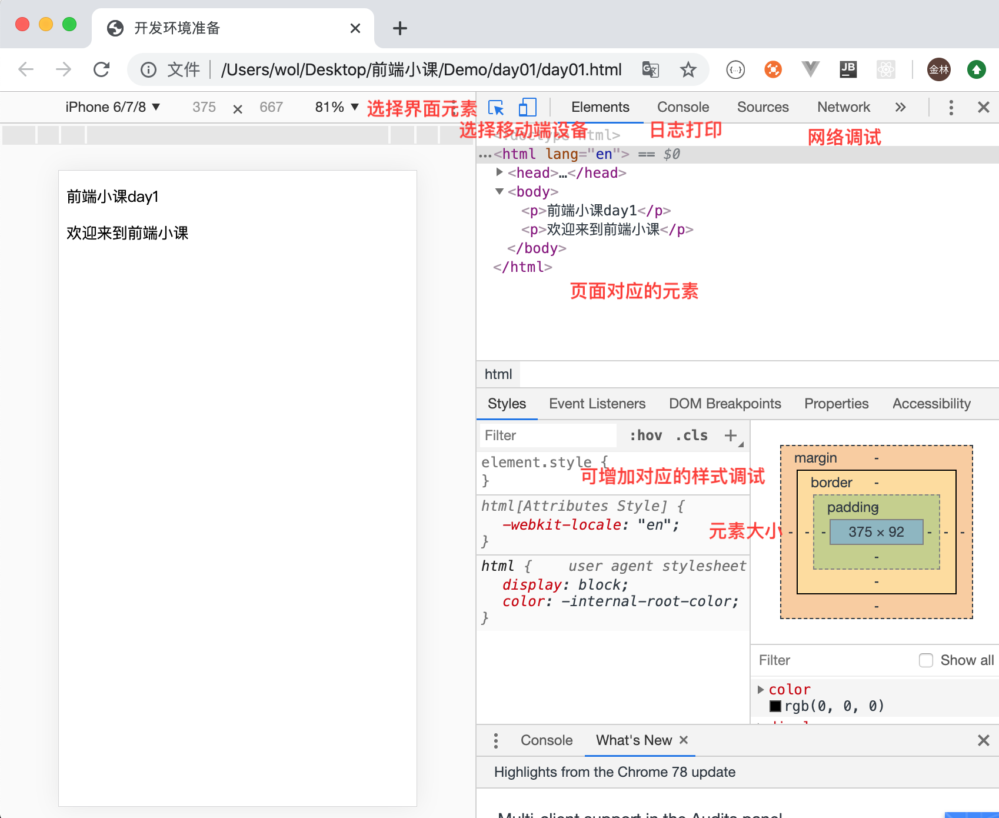

# 前端学习，开篇
作为前端新手，打算从基础一步步梳理知识点学习，记录下这个阶段的学习，希望有所收获！---开始于2019.11.11
## 开发环境准备
- 主要使用编辑器[VSCode](https://code.visualstudio.com/)进行开发，它有强大的插件系统，学习过程从会记录一些插件的使用
- VSCode界面 

新建文件day01.html,输入html5，会自动填充对应的代码，包含html文件的基本内容

可直接在Chrome浏览器地址栏中输入html文件的绝对路径，将文件打开，如：
`/Users/wol/Desktop/前端小课/Demo/day01/day01.html`

>tips: 课通过安装`open in browser`插件，插件安装完成后，选择对应的html文件，右击即可点击`open in browser`

文件效果如下：

点击**检查**进入开发模式。
该界面主要是调试界面，常用的有选择对应的移动端设备、选中元素、CSS调试、网络调试、日志打印等，界面如下：

## 插件推荐
- Auto Close Tag
- Auto Rename Tag
- HTML CSS Support
- Open in browser
