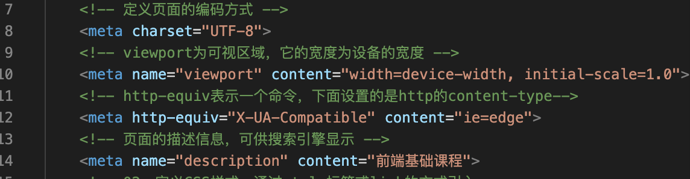
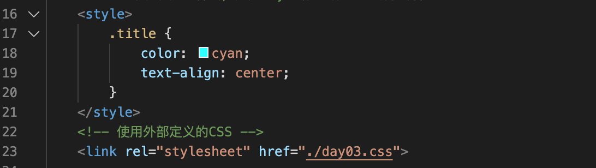
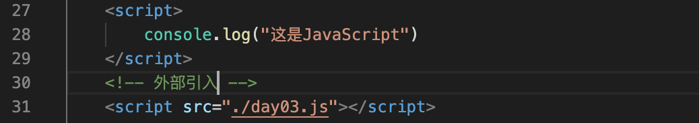

# HTML常用的标签

## head标签
MDN对head标签的解释：

The **Head** is the part of an HTML document that contains metadata about that document, such as author, description, and links to CSS or JavaScript files that should be applied to the HTML.
由此可见head标签中的内容是为了描述网页的“额外”信息，主要是给浏览器或者搜索引擎使用的。而具体的信息是在body中定义的。其中比较重要的元数据标签meta，它通过key和value的形式提供不同的内容。总的来说head中可以定义：

**1、**定义基本的元数据信息。提供关于文档的额外信息：

**02、**定义CSS样式，通过style标签或link的方式引入：

**03、**定义JavaScript内容，可通过script标签内部写或者link标签外部引入的方式：

**Mark：head中定义的JavaScript将会在页面加载前执行，会阻塞页面加载，所以往往将JavaScript定义在body标签中**

**04、**定义title标签，即文档的标题

