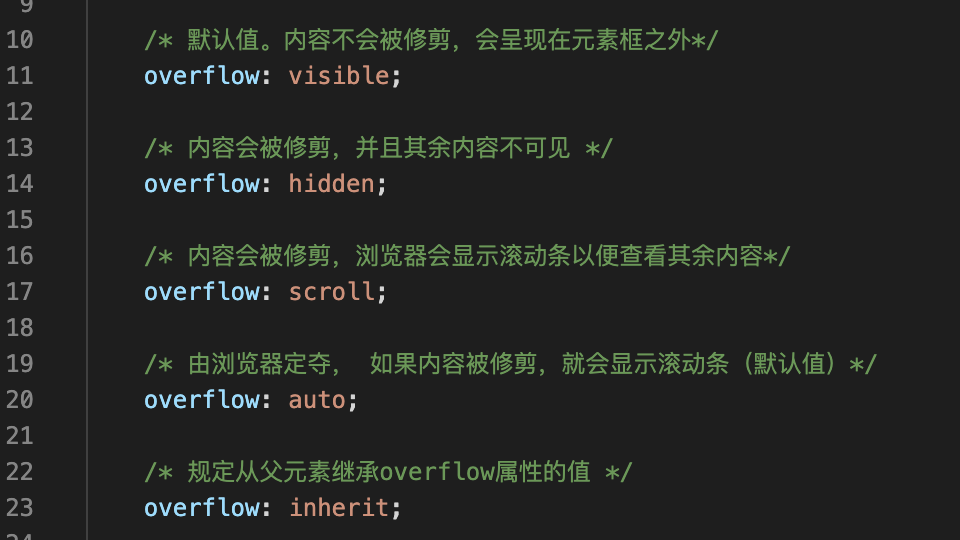
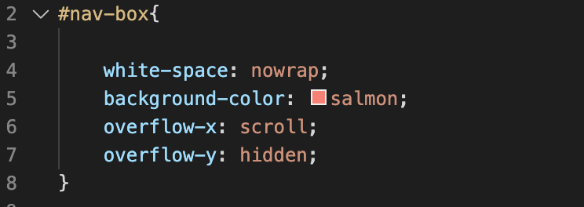

# 设计一个左右滑动的菜单
## 需要实现的功能
- 所有的菜单单行不显示，不折行

    前端默认的布局方式是流式布局，布局方式和代码书写顺序一致，在流式布局中，span是inline标签，而div是块级标签，这两个标签的区别是块级标签独占一行，二inline标签会累加，如同打字，一个一个往后拼接，单行显示不全会折行显示。

    使用span能实现这个效果，但是需要的是不换行。CSS中提供一个属性`white-space`，它的作用是告诉浏览器遇到空格该如何处理，但是这个空格不是单纯意义的空格。

    它的默认值是`normal`，即遇到空格字会折叠。另外一个属性`nowrap`恰好相反，它的意思是不折叠一直显示，符合要求。因此，对应的CSS可定义为：

            #nav-box{
                white-space: nowrap;
                background-color: salmon;
            }

- 菜单可以左右滑动

    左右滑动意味着对超出的可视区域的内容进行滚动处理。CSS有一个属性`overflow`,它可以控制对于超出可视区域的内容如何处理。可以通过`overflow-x`和`overflow-y`分别控制各个方向的滚动。

    

    最终容器的CSS如下，x轴可以滚动，y轴内容超出时隐藏，如下
    

- 点击按钮，让某个菜单滚动中间

    可以通过DOM操作滚动 `element.scrollTo(x,y)`
    