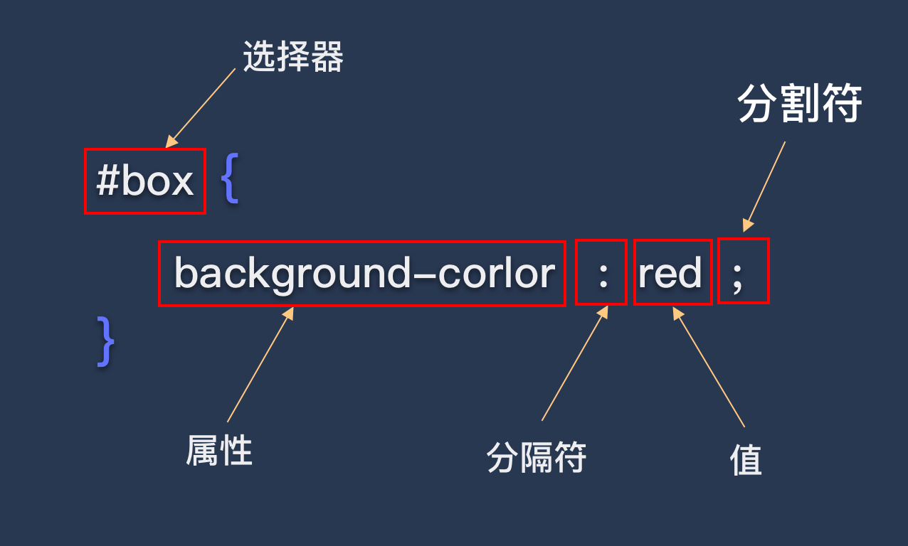

# CSS中的选择器

选择器的目的是为了能够把定义好的CSS样式作用于指定HTML标签上。

CSS相关的语法可以通过下面这张图读懂：

（图片来源于网络）

## 选择器的种类

### **标签选择器**
通常以标签为选择器，这种写法会把所有对应的标签样式均修改为声明的样式，如下面的写法会把所有的p标签背景改为红色

    p{
        background-color: red;
    }
    
### **class选择器**
以.开头，后面跟一个名称，可作用于多个HTML标签

    .test-one{
        font-size: 20px;
        color: cyan;
        text-decoration: line-through;
    }

### **id选择器**
以“#”开头，后面跟一个选择器的名字，名字在当前文档中唯一。

    #test-second{
        color: cyan;
        font-size: 15px;
        text-align: center;
    }
 ### **通用选择器**
 单独一个`*`，作用于所有的标签，如下方示例，清除HTML中所有标签的默认边距

    *{
        margin: 0px;
        padding: 0px;
    }
### **属性选择器**
根据属性来匹配HTML元素

