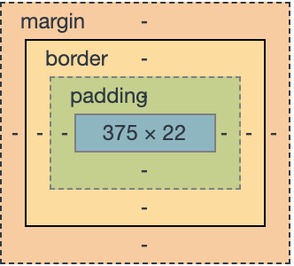

# CSS 样式基础
## 了解CSS
### 基础概念
CSS样式称为层叠样式表，即多重样式定义被层叠在一起成为一个整体，在网页中是标准的布局语言，用来控制元素的尺寸、颜色和排版等属性。
### CSS的版本发展
- **CSS1**:CSS1是CSS的第一层次标准，正式发布于1996年12月。该标准提供简单的CSS样式表机制，主要定义了网页的基本属性，如字体、颜色、空白边等；
- **CSS2**:CSS2基于CSS1，于1998年5月正式作为标准发布。包含了CSS1的所有特点和功能，并在多个领域进行完善，将样式文档和文档内容进行分离。
- **CSS3**：CSS3规范目前处于完善之中，因此浏览器的支持程度各有不同。为了让用户能够体验到CSS3的好处，各主流浏览器都定义了自己的私有属性。
    - 浏览器对CSS3的支持：
        - Webkit内核浏览器(Safari、Chrome)的私有属性的前缀是`-webkit-`;
        - Gecko内核浏览器(Firefox)的私有属性的前缀是`-moz-`;
        - Opera浏览器的私有属性的前缀是`-o-`;
        - IE浏览器(限于IE8+)的私有属性的前缀是`-ms-`.
    - CSS3的全新功能:
        - 功能强大的选择器：CSS3增加了更多的CSS选择器，可以实现更简单但是更强大的功能；
        - 文字效果：CSS3中，可以给文字添加阴影、描边和发光等效果，自定义特殊字体等；
        - 边框：CSS3中，可以直接给边框设计圆角、阴影、边框背景等；
        - 背景：可以改变背景图片的大小、裁剪背景图片、设置多重背景；
        - 色彩模式：除了支持RGB颜色外，还支持HSL(色调、饱和度、亮度)并且针对这两种色彩模式，又增加了可以控制透明度的色彩模式；
        - 盒布局和多列布局：弥补现有布局的不足，为页面布局提供更多的手势，并大幅度地缩减了代码；
        - 渐变：支持渐变的设计。
        - 动画：有了CSS3的动画，可以不用编写脚本，直接就可以让界面元素动起来，并且不会影响整体的界面布局
        - 媒体查询：CSS3提供了丰富的媒体查询功能，可以根据不同的设备、不同的屏幕尺寸来自动调整界面的布局。
## CSS样式语法
CSS样式由选择器和属性构成，CSS样式的基本语法如下：

    CSS选择器{
        属性1:属性值1，
        属性2:属性值2，
        ... ...
    } 
### 规则构成
- 选择器
    - 选择器部分指定对文档中的哪个对象进行定义；
- 声明
    - 声明包含在{}内部，在大括号内部给出属性名，冒号，属性值，结尾分号
- 属性
    - 属性由官方CSS规范定义
- 属性值
    - 属性值的范围在CSS规则定义。

## CSS选择器
选择器的目的是为了能够把定义好的CSS样式作用于指定HTML标签上。
### 通配选择器
>单独一个`*`，作用于所有的标签，如下方示例，清除HTML中所有标签的默认边距

    *{
        margin: 0px;
        padding: 0px;
    }
### 标签选择器
>通常以标签为选择器，这种写法会把所有对应的标签样式均修改为声明的样式，如下面的写法会把所有的p标签背景改为红色:

    p{
        background-color: red;
    }
### id选择器
>以“#”开头，后面跟一个选择器的名字，名字在当前文档中**唯一**。

    #id_name{
        color: cyan;
        font-size: 15px;
        text-align: center;
    }

### 类选择器
>以.开头，后面跟一个名称，可作用于多个HTML标签:

    .class_name{
        font-size: 20px;
        color: cyan;
        text-decoration: line-through;
    }
### 伪类和伪对象选择器
>伪类及伪对象是一种特殊的类和对象，由CSS样式自动支持，属CSS的一种扩展类型和对象，名称不能被用户定义，使用时只能按照标准格式进行应用，形如：

    a:hover{
        color: greenyellow;
    }

伪类和伪对象由以下两种形式组成：

    选择器：伪类
    选择器：伪对象

CSS内置伪类如下：
- **:link** : a链接标签的未被访问前的样式
- **:hover** : 对象在鼠标移动时的样式
- **:active** : 对象被用户点击及被释放之间的样式
- **:visited** : a链接对象被访问后的样式
- **:focus** : 对象成为输入焦点时的样式
- **:first-child** : 对象的第一个子对象的样式
- **:first** : 对于页面的第一页使用的样式

        /* 匹配超链接样式 */
        a {
            color: red;
            font-weight: bold;
        }
        /* 访问后的状态 */
        a:visited {
            color: greenyellow;
        }
        /* 鼠标悬停、点击、聚焦时的样式 */
        a:hover,
        a:active,
        a:focus {
            color: hotpink;
            text-decoration: line-through;
        }

CSS内置伪对象如下:
- **:after** : 设置某一个对象之后的内容
- **:first-letter** : 对象内的第一个字符的样式设置
- **:first-line** : 对象内第一行的样式设置
- **:before** : 设置某一个对象之前的内容

### 群组选择器
对一组对象进行相同的CSS样式设置，不同元素使用逗号隔开。形如：

    div,p,span,h1{
        color:red;
    }

### 组合选择器
组合选择器可以作用于多个html元素，有多种组合方式。

**A B { }**: A元素的所有后代元素B都会起作用。下面示例中`div p {}`,它会遍历div中所有的子元素p，只要找到p元素就应用对应的CSS样式。

    div p {
        font-size:12px;
    }
**A > B {}**:A元素的直接子节点会起作用，即只适用于A节点的第一层所有的子节点。例子中`div > p{}`，只会找到div的第一层子节点p。

    div > p {
        color: red;
    }
**A + B{}**:匹配A的下一个兄弟节点，AB具有相同的父节点，并且B紧跟在A的后面；例子中`div + p{}`只会匹配div的下一个兄弟节点p;

    div + p{
        color: red;
    }
**A~B{}**:B是A之后的任意一个兄弟节点。例子中`div~p{}`会匹配div的所有兄弟节点p;
 
    div ~ p{
        color:red;
    }

### 属性选择器（CSS3新增）
根据属性来匹配HTML元素

    /*01、匹配所有使用属性‘lee’的元素*/
    [lee]{
        background-color:green;
    }
    /*02、匹配所有使用属性为‘lee’，且值为red的元素*/
    [lee="red"]{
        background-color: cyan;
    }
    /*03、匹配所有使用属性为‘lee’，且包含dark的元素*/
    [lee~="test"]{
        background-color: darkorange;
        font-size: 30px;
        font-weight: bold;
    }

例如：

    
匹配所有使用属性‘lee’的元素
        
测试下属性选择器

        
测试下属性选择器

        
测试下属性选择器

    

    
匹配所有使用属性为‘lee’，且值为red的元素
        
测试下属性选择器

    

    
匹配所有使用属性为‘lee’，且包含test的元素
        
测试下属性选择器

        
测试下属性选择器

    

    
还有类似于“正则表达式”的属性选择器，比如：`[attr^=val]`匹配以val开头的元素，`[attr$=val]`,匹配以val结尾的元素，`[attr*=val]`匹配包含val的字符串的元素.  

    
类似正则表达式的属性选择器
        
匹配以 val 开头的元素

        
匹配以 val 结尾的元素

        
匹配包含 test 的字符串的元素

    

### 结构伪选择器（CSS3新增）
### UI元素状态伪类选择器（CSS3新增）
### 伪元素选择器
伪元素选择器形式如下表：

-**E:first-letter/E::first-letter** : 设置对象内的第一个字符的样式
-**E:first-line/E::first-line** : 设置对象内的第一行的样式
-**E:before/E::before** : 设置在对象前发生的内容，用来和content属性一起使用
-**E:after/E::after** : 设置在对象后发生的内容，用来和content属性一起使用
-**E:*selection**   : 设置对象被选择时的颜色

例子：

    p:first-letter{
        font-weight: 900;
        color: red;
        background-color: goldenrod;
    }
    p:first-line{
        font-size: 3em;
    }
    p:after{
        content: '😄';
    }

## 应用CSS样式
- **内联CSS样式**
使用内联样式方法是直接在HTML标签中使用style属性，该属性的值就是CSS的属性和值，形如：
    
        

内联CSS样式

>Tips:不符合表现与内容分离的设计模式，尽量少用.
- **内部CSS样式**
内部样式是将CSS样式代码添加到`<head>`和`</head>`标签之间，并用``标签进行声明。如：

        <head>
            
        </head>
>Tips:虽然未完全实现页面内容和CSS样式完全分离，但可以将内容与HTML代码分离在两个部分进行同一管理。只针对当前界面有效，不能跨页面使用，该方法只适合用于单一页面设置单独的CSS样式。

- 链接外部CSS样式表文件
外部CSS样式表文件是CSS样式中一种较为理想的形式，代码编写在一个独立的文件中，多个网页可以调用同一个CSS样式表文件，可以实现代码的最大化重用及网站文件的最优化配置。链接外部CSS样式必须放在`<head>`和`</head>`标签之间，语法格式为：

        <!-- rel:指定链接到CSS样式，值为：stylesheet;type:指定链接文件的类型为CSS样式表;herf为CSS样式文件（绝对/相对）路径  -->
        <link rel="stylesheet" type="text/css" href="xxx.css">

>Tips:
- 导入外部CSS样式表文件的方式优势明显，如：独立与HTML文件，便于修改；多个文件可引用同一个CSS文件；只需下载一次，即可在其他链接了该文件中的页面中使用；浏览器会先加载HTML内容，再根据CSS文件渲染，加快显示速度；强烈推荐使用！

- 导入外部CSS样式表文件
同链接外部CSS样式表文件基本相同，只是在语法和运作方式上有所区别。采用导入的CSS样式方式，在HTML文件初始化时，会被导入到HTML文件内，成为文件的一部分，类似内部CSS样式。导入的外部CSS样式表文件是指在嵌入样式的``标签中，使用`@import`命令导入一个外部CSS样式表文件。
>Tips:优点在于可以一次导入多个外部CSS样式文件。导入外部CSS样式文件必须在在内部CSS样式开始部分，即其他内部CSS样式代码之前。

## CSS3盒模型和界面设计
### 盒模型
所有的界面元素都包含在一个矩形内，这个矩形框就称为盒模型。

盒模型包含内容四部分内容：
- margin(边界)属性:称为边界或外边距，用来设置内容与内容之间的距离；
- border(边框)属性:称为边框或内容边框线，可以用来设置边框的粗细、颜色和样式等；
- padding(填充):称为填充或内边距，用来设置内容与边框之间的距离；
- content(内容):可以放置文字、图片等。
>Tips:盒模型的实际高度或宽度由 `content`+`padding`+`border`+`margin`组成。

**注意⚠️：**
- 1、边框的默认样式(border-style)可设置为不显示（none）;
- 2、填充值(padding)不可为负；
- 3、边界值(margin)可以为负，但显示效果在各浏览器中可能不同
- 4、内联元素，定义上下边界(margin)不会影响到行高，如`<a>`
- 5、块级元素，未浮动的垂直相邻元素的上下边界会被压缩
- 6、浮动元素边界不压缩，如果浮动元素不声明宽度，则其宽度趋向于0，即压缩到其内容能承受的最小宽度；
- 7、如果盒中没有内容，即使定义宽高都为100%，实际上只占0%，因此不会显示。

### CSS3弹性盒模型
>TODO:
- 资料
    - [Flex布局](http://www.ruanyifeng.com/blog/2015/07/flex-grammar.html)

### 元素定位
- position属性
- relative：相对定位
- absolute：绝对定位
- fixed：固定定位

### 多列布局属性
- columns属性：多列布局
- column-width:列宽度
- column-count:列数
- column-gap:列间距
- column-rule属性
- column-span属性

